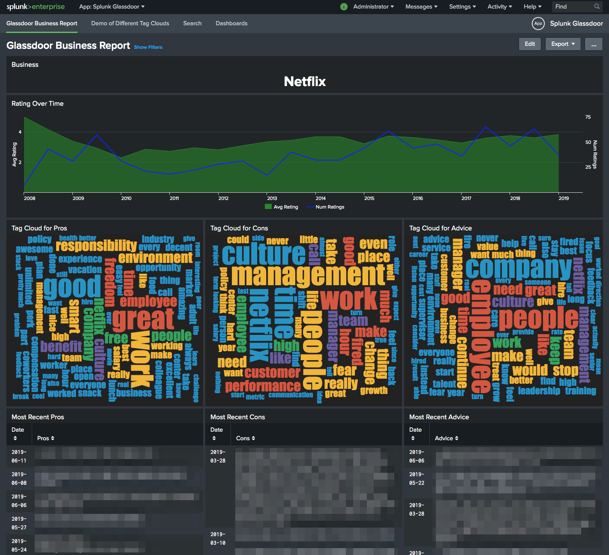
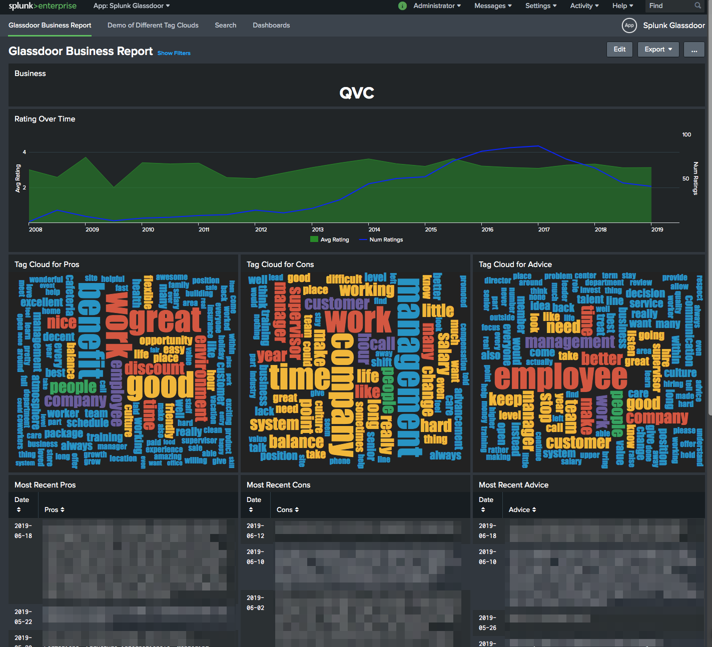

# Splunking Glassdoor Reviews

This project is based largely on the work I did for 
my <a href="https://github.com/dmuth/splunk-yelp-reviews">Splunk Yelp project</a>
not too long ago.  The impetus for it came about when a local tech company pinged 
me about the possibility of working for them, and I wanted to see what other people
thought of their company.  Thus, Splunk Glassdoor was born!

This app will tell you the following:

- Avg ratings/number of ratings over time
- Recent pros, cons, and advice to management
- Tag cloud of words from pros, cons, and advice to management

In real-life, I've used this app to check out potential employers.

This app uses <a href="https://github.com/dmuth/splunk-lab">Splunk Lab</a>, an open-source 
app I built to effortlessly run Splunk in a Docker container.

# Screenshots

## Requirements

- Docker

## Running The App

- `SPLUNK_START_ARGS=--accept-license bash <(curl -s https://raw.githubusercontent.com/dmuth/splunk-glassdoor/master/go.sh ) ./urls.txt`
   - The file `urls.txt` should contain one URL per line, and each URL should be a business's review page from Glassdoor.
   - Since some businesees can have thousands of reviews, this script will pick up where it left off if interrupted.
   - This grabs the HTML from review pages uses <a href="https://www.crummy.com/software/BeautifulSoup/bs4/doc/">Beautiful Soup</a> to parse the reviews and then export them to the `logs/` directory.  I looked into using Glassdoor's API, but when I went to the signup page, it was a broken page that was mostly blank.  So I tried 🤷.
   - The script is single threaded, but reasonably efficient. (and I don't want to DoS Glassdoor's website)  I've clocked downloads at 5,000 in a little over 8 minutes, or about 600 reviews a minute.
- Go to <a href="https://localhost:8000/">https://localhost:8000/</a>, log in with the password you set, and you'll see the Glassdoor Reviews Dashboard.

## Troubleshooting

- Q: Dashboards show ` Search is waiting for input...`
- A: You need to select a venue in the dropdown!  If no items are in the dropdown, that means no data was ingested.  Did you run the command to download some Glassdor reviews?

## Development

Mostly for my benefit, these are the scripts that I use to make my life easier:

- `./bin/build.sh` - Build the Python and Splunk Docker containers
- `./bin/push.sh` - Upload the Docker containers to Docker Hub
- `./bin/devel.sh` - Build and run the Splunk Docker container with an interactive shell
- `./bin/run-download-reviews.sh` - Run the script to download reviews directly
- `./bin/stop.sh` - Stop the Splunk container
- `./bin/clean.sh` - Stop Splunk, and remove the data and logs

## Credits

I'd like to thank <a href="http://splunk.com/">Splunk</a>, for having such a kick-ass data
analytics platform, and the operational excellence which it embodies.

Also:
- <a href="https://www.ascii-art-generator.org/">This text to ASCII art generator</a>, for the logo I used in the script.

## Bugs

- Sometimes you'll see a yellow exclamation point with the text "Field 'words' does not exist in the data" on the Advice Tag Cloud.  The underlying search appears to be executing normally, so I can trying to sort this one out.

## Copyright

Splunk is copyright by Splunk.  Apps within Splunk Lab are copyright their creators,
and made available under the respective license.  

## Contact

- <a href="mailto:doug.muth@gmail.com">Email me</a>
- <a href="https://twitter.com/dmuth">Twitter</a>
- <a href="https://facebook.com/dmuth">Facebook</a>

